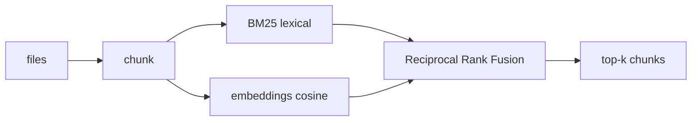

# semble-go

A small, dependency-light Go port of [Semble](https://github.com/MinishLab/semble):
**token-efficient semantic code search** for agents. It indexes a repository into
code-aware chunks and answers queries by returning only the most relevant
snippets — not whole files — so an agent burns a fraction of the tokens it would
spend on `grep` + reading files.

## How it works



- **Chunking** (`index/chunk.go`): pure-Go, no CGO. Files are split on blank-line
  boundaries with a size cap, keeping chunks roughly aligned to logical blocks.
- **Lexical** (`index/bm25.go`): Okapi BM25 over an identifier-aware tokenizer
  that splits `camelCase`, `snake_case` and digit boundaries.
- **Semantic** (`index/embed.go`): a pure-Go `HashEmbedder` (hashing trick +
  char trigrams) produces dense, L2-normalized vectors compared by cosine.
- **Fusion** (`index/rrf.go`): the two rankings are merged with RRF.
- **Cache** (`index/index.go`): the chunked corpus + vectors are cached under
  `$XDG_CACHE_HOME/semble-go` and reused while the file set is unchanged
  (fingerprinted by path/size/mtime).

The embedder sits behind an `Embedder` interface, so a real Model2Vec backend
(e.g. `potion-code`) can be dropped in later without touching the index — the
default stays pure-Go and offline.

## Install

```sh
go install github.com/denysvitali/semble-go@latest   # installs `semble-go`
# or, from a clone:
make build                                            # builds ./semble
```

## CLI

```sh
semble search "where are http requests retried" ./path  [--top-k 10] [--content code|docs|config|all]
semble find-related path/to/file.go 42 ./path           [--top-k 10]
semble savings ./path                                   [--content all]
semble init [--agent claude|cursor|codex]               # prints MCP config
semble serve                                            # run as MCP server (stdio)
```

`path` defaults to the current directory.

## MCP server

`semble serve` exposes two read-only tools over stdio:

- **search** — `query`, `repo` (local path), `top_k`, `content`
- **find_related** — `file`, `line`, `repo`, `top_k`

Wire it into an agent with `semble init`:

```jsonc
// .mcp.json
{
  "mcpServers": {
    "semble": { "command": "semble", "args": ["serve"] }
  }
}
```

## Differences from upstream Semble

- Heuristic chunking instead of tree-sitter (no CGO / per-language grammars).
- Pure-Go hashing embedder by default instead of the `potion-code` Model2Vec
  model. Lexical (BM25) recall matches upstream intent; true distilled semantic
  recall awaits a Model2Vec backend behind the `Embedder` interface.
- Local repositories only (no remote git-URL cloning yet).

## License

MIT — see [LICENSE](LICENSE). This is an independent Go port inspired by
[MinishLab/semble](https://github.com/MinishLab/semble) (MIT, © 2026 Thomas van Dongen).
```
